<p align="center">
  
</p>

<h1 align="center">terrarium</h1>

<p align="center">
  <strong>Autonomous open source, powered by <a href="https://www.x402.org/">x402</a> + GitHub + <a href="https://openrouter.ai/">OpenRouter</a></strong>
</p>

---

Fund an open source project. Terrarium manages the budget, files issues, writes code, reviews PRs, and ships features — no human holds the keys.

## How it works

```mermaid
graph LR
    A["Project launches<br/>donation token"] --> B["Supporters buy<br/>$PROJECT on Zora"]
    B --> C["Trading fees flow<br/>to treasury"]
    C --> D["OIDC-gated<br/>smart wallet"]
    D --> E["Terrarium tops up<br/>OpenRouter credits"]
    E --> F["Terrarium files issues<br/>from milestones"]
    F --> G["Terrarium Workers<br/>write code & open PRs"]
    G --> H["Terrarium reviews<br/>& merges"]
    H --> I["Project ships<br/>features"]
    I -->|"better project → more supporters"| B

    style A fill:#2d333b,stroke:#58a6ff,color:#e6edf3
    style B fill:#2d333b,stroke:#58a6ff,color:#e6edf3
    style C fill:#2d333b,stroke:#58a6ff,color:#e6edf3
    style D fill:#2d333b,stroke:#58a6ff,color:#e6edf3
    style E fill:#2d333b,stroke:#58a6ff,color:#e6edf3
    style F fill:#2d333b,stroke:#58a6ff,color:#e6edf3
    style G fill:#2d333b,stroke:#58a6ff,color:#e6edf3
    style H fill:#2d333b,stroke:#58a6ff,color:#e6edf3
    style I fill:#2d333b,stroke:#58a6ff,color:#e6edf3
```



## Getting started

```bash
cd my-project
npx terrarium --install
```

The installer deploys a treasury wallet, creates a donation token, sets up GitHub Actions workflows, and creates your first milestone. Push your repo and Terrarium starts building.

## Principles

- **No human holds the keys.** The treasury is a smart wallet controlled by cryptographic proof that code is running in a public repo — no private key exists.
- **Code is the authority.** All behavior is open-source, auditable, and pinned to a specific commit.
- **Repo must be public.** The contract rejects transactions if the repo goes private.
- **Tokens are donations.** Holders receive no revenue, governance, or dividends.
- **Milestones are the interface.** Steer the project by creating GitHub Milestones. No config files, no commits needed to change direction.
- **Everything is traceable.** Every on-chain transaction links to a GitHub Actions run and commit.

<details>
<summary>Architecture</summary>

- **Treasury** — an ERC-4337 smart wallet on Base, authorized via [GitHub Actions OIDC](https://docs.github.com/en/actions/concepts/security/openid-connect). No private key.
- **Funding** — each project gets a Zora bonding curve token. Trading fees flow to the treasury.
- **Inference** — OpenRouter provides AI. Terrarium manages model tiers based on available budget.
- **Coordination** — Terrarium reads milestones, files issues, dispatches workers, reviews PRs, and merges.

</details>

<details>
<summary>Project structure</summary>

```
terrarium/
  contracts/                   Solidity (Foundry) — OIDC-gated ERC-4337 wallet
  crates/
    core/                      Shared library
    owner/                     Terrarium coordinator binary
    employee/                  Worker Docker image + entrypoint
    cli/                       Installer CLI
  .github/workflows/
    owner.yml                  Reusable coordinator workflow
    release.yml                Binary release pipeline
  templates/
    terrarium.yml              Caller workflow template
    employee.yml               Worker workflow template
```

</details>

## License

MIT

---

*Terrarium is an independent project and is not affiliated with, endorsed by, or formally associated with x402, GitHub, OpenRouter, Zora, or any other referenced projects or services.*
